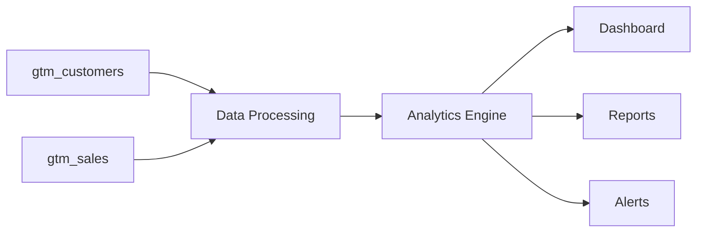

# GTM 데이터 분석 전략 (GTM Data Analytics Strategy)

## 1. 데이터 구조 개요

### 1.1 테이블 구조
```
GTM 데이터베이스
├── gtm_customers (전체 KT 기업 고객)
│   ├── 12,231개 전체 고객 데이터
│   ├── 해외 사업장 보유 여부 필드
│   └── 타사 글로벌 서비스 사용 현황
│
└── gtm_sales (현재 글로벌 서비스 고객)
    ├── gtm_sales_master (고객 마스터 정보)
    └── gtm_sales_revenues (월별 매출 데이터)
```

### 1.2 데이터 분류
- **잠재 고객군**: gtm_customers 중 해외 사업장 보유 기업
- **현재 고객군**: gtm_sales에 등록된 글로벌 서비스 이용 고객

## 2. 분석 카테고리

### 2.1 잠재 고객 분석 (Potential Customer Analysis)
**데이터 소스**: gtm_customers

#### A. 시장 기회 분석 (Market Opportunity)
```sql
-- 해외 사업장 보유 고객 중 글로벌 서비스 미사용 기업
SELECT COUNT(*) as opportunity_count
FROM gtm_customers
WHERE overseas_presence_2025 = true
  AND kt_global_data_usage_2025 = false
  AND other_global_data_usage = false;
```

#### B. 경쟁사 전환 대상 (Competitor Switch Targets)
```sql
-- 타사 서비스 사용 중인 고객
SELECT 
  other_provider_name,
  COUNT(*) as customer_count,
  SUM(other_monthly_fee) as total_monthly_revenue
FROM gtm_customers
WHERE other_global_data_usage = true
GROUP BY other_provider_name;
```

#### C. 갱신 시점 기회 (Renewal Opportunities)
```sql
-- 향후 90일 내 갱신 예정 고객
SELECT *
FROM gtm_customers
WHERE renewal_date BETWEEN CURRENT_DATE AND CURRENT_DATE + INTERVAL '90 days'
ORDER BY renewal_date;
```

### 2.2 현재 고객 분석 (Current Customer Analysis)
**데이터 소스**: gtm_sales_master, gtm_sales_revenues

#### A. 매출 성과 분석 (Revenue Performance)
```sql
-- 월별 매출 추이
SELECT 
  month_code,
  SUM(revenue_amount) as total_revenue,
  COUNT(DISTINCT service_id) as active_services
FROM gtm_sales_revenues
GROUP BY month_code
ORDER BY month_code;
```

#### B. 고객군별 분석 (Customer Segment Analysis)
```sql
-- 고객군별 매출 분포
SELECT 
  customer_group,
  COUNT(DISTINCT service_id) as service_count,
  AVG(revenue_amount) as avg_monthly_revenue
FROM gtm_sales_master m
JOIN gtm_sales_revenues r ON m.service_id = r.service_id
GROUP BY customer_group;
```

#### C. 서비스 유형별 분석 (Service Type Analysis)
```sql
-- 서비스 유형별 성과
SELECT 
  service_type,
  COUNT(*) as count,
  SUM(capacity::numeric) as total_capacity
FROM gtm_sales_master
GROUP BY service_type;
```

## 3. 대시보드 구성요소

### 3.1 Executive Summary Dashboard

#### KPI Cards
1. **총 잠재 고객 수**
   - 해외 사업장 보유 기업 수
   - 글로벌 서비스 미사용 기업 수
   - 타사 서비스 사용 기업 수

2. **현재 고객 현황**
   - 활성 서비스 수
   - 월 평균 매출
   - 전월 대비 성장률

3. **시장 기회**
   - 총 잠재 시장 규모 (TAM)
   - 서비스 가능 시장 (SAM)
   - 획득 가능 시장 (SOM)

#### Charts
1. **파이 차트**: 고객 분류별 분포
2. **라인 차트**: 월별 매출 추이
3. **바 차트**: 경쟁사별 고객 수
4. **히트맵**: 지역별/산업별 분포

### 3.2 잠재 고객 대시보드 (Potential Customer Dashboard)

#### 필터 옵션
- 본부별 (headquarters)
- 팀별 (team)
- 해외 사업장 유무
- 타사 서비스 사용 여부
- 갱신 시점

#### 분석 컴포넌트
1. **우선순위 매트릭스**
   ```
   높은 가치 + 빠른 갱신 = 최우선 타겟
   높은 가치 + 늦은 갱신 = 장기 육성
   낮은 가치 + 빠른 갱신 = 기회 포착
   낮은 가치 + 늦은 갱신 = 모니터링
   ```

2. **경쟁사 분석 테이블**
   - 경쟁사명
   - 고객 수
   - 평균 월 요금
   - 갱신 예정 고객 수

3. **영업 기회 리스트**
   - 고객명
   - 현재 상태
   - 예상 가치
   - 다음 액션
   - 담당자

### 3.3 현재 고객 대시보드 (Current Customer Dashboard)

#### 매출 분석
1. **월별 트렌드**
   - 매출 추이
   - 성장률
   - 계절성 분석

2. **고객군별 분석**
   - 대기업/중견/중소
   - 산업별 분포
   - 서비스별 매출

3. **성과 지표**
   - ARPU (고객당 평균 매출)
   - Churn Rate (이탈률)
   - LTV (고객 생애 가치)

### 3.4 통합 분석 대시보드 (Integrated Analytics)

#### Cross-Reference Analysis
1. **전환 가능성 분석**
   ```sql
   -- gtm_customers와 gtm_sales 교차 분석
   SELECT 
     c.customer_name,
     c.other_provider_name,
     c.other_monthly_fee,
     s.revenue_amount as our_avg_revenue
   FROM gtm_customers c
   LEFT JOIN (
     SELECT customer_name, AVG(revenue_amount) as revenue_amount
     FROM gtm_sales_master m
     JOIN gtm_sales_revenues r ON m.service_id = r.service_id
     GROUP BY customer_name
   ) s ON c.customer_name = s.customer_name
   WHERE c.other_global_data_usage = true;
   ```

2. **성장 잠재력 분석**
   - 현재 고객 중 추가 서비스 가능 기업
   - 해외 사업장 신규 보유 기업
   - 업셀/크로스셀 기회

## 4. 주요 인사이트 도출

### 4.1 영업 전략 인사이트

1. **Quick Wins**
   - 90일 내 갱신 예정 타사 고객
   - 소규모 테스트 가능 기업
   - 기존 KT 서비스 heavy user

2. **Strategic Accounts**
   - 대규모 해외 사업장 보유 기업
   - 다년 계약 가능 기업
   - 산업별 레퍼런스 고객

3. **Defensive Strategy**
   - 현재 고객 중 이탈 위험 식별
   - 경쟁사 공격 대응
   - 서비스 만족도 개선 대상

### 4.2 시장 확대 전략

1. **산업별 접근**
   ```
   제조업 → 해외 공장 네트워크
   유통업 → 글로벌 SCM
   IT/서비스 → 해외 개발센터
   ```

2. **지역별 확대**
   ```
   동남아 진출 기업
   중국 사업장 보유 기업
   미주/유럽 진출 기업
   ```

## 5. 액션 아이템

### 5.1 단기 (1-3개월)
- [ ] 90일 내 갱신 예정 고객 영업 활동
- [ ] Quick Win 고객 타겟팅
- [ ] 경쟁사 고객 전환 캠페인

### 5.2 중기 (3-6개월)
- [ ] Strategic Account 관리 체계 구축
- [ ] 산업별 특화 솔루션 개발
- [ ] 고객 성공 프로그램 도입

### 5.3 장기 (6-12개월)
- [ ] 신규 시장 진출 전략
- [ ] 파트너십 확대
- [ ] 서비스 포트폴리오 확장

## 6. 성과 측정 지표 (KPIs)

### 6.1 영업 성과
- 신규 고객 획득 수
- 전환율 (Lead to Customer)
- 평균 계약 규모
- 영업 사이클 기간

### 6.2 고객 성과
- 고객 만족도 (CSAT)
- 순추천지수 (NPS)
- 고객 유지율
- 업셀/크로스셀 비율

### 6.3 재무 성과
- 월 경상 수익 (MRR)
- 연 경상 수익 (ARR)
- 고객 획득 비용 (CAC)
- 투자 수익률 (ROI)

## 7. 기술 구현 사항

### 7.1 데이터 파이프라인


### 7.2 실시간 모니터링
- 갱신 알림 시스템
- 영업 기회 스코어링
- 이상 징후 감지

### 7.3 예측 분석
- 이탈 예측 모델
- 매출 예측 모델
- 고객 가치 예측

## 8. 다음 단계

1. **즉시 실행**
   - 대시보드 프로토타입 개발
   - 주요 SQL 쿼리 최적화
   - 초기 데이터 검증

2. **1주차**
   - React 컴포넌트 구현
   - Supabase 연동 완료
   - 기본 차트 구현

3. **2주차**
   - 고급 분석 기능 추가
   - 필터링/정렬 기능
   - 엑셀 내보내기

4. **3주차**
   - 사용자 피드백 반영
   - 성능 최적화
   - 문서화 완료